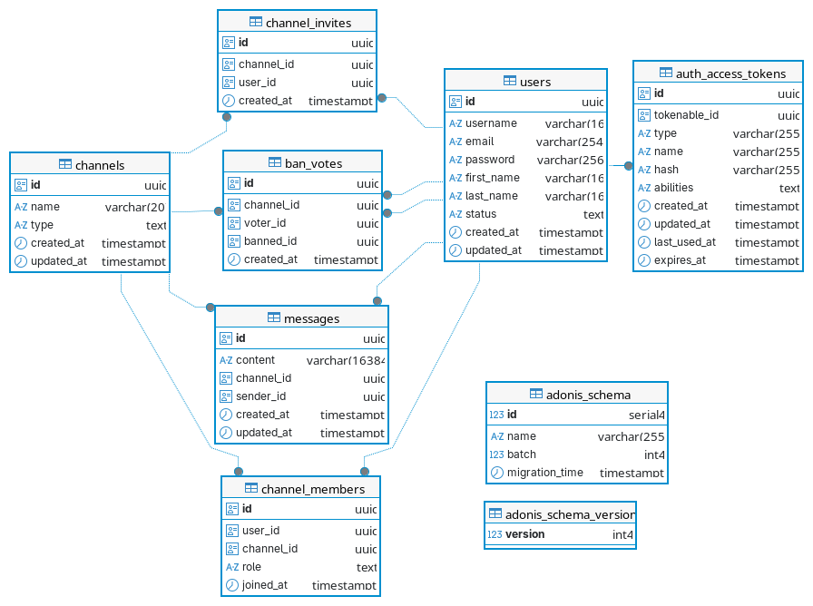
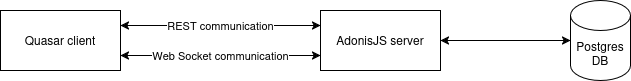
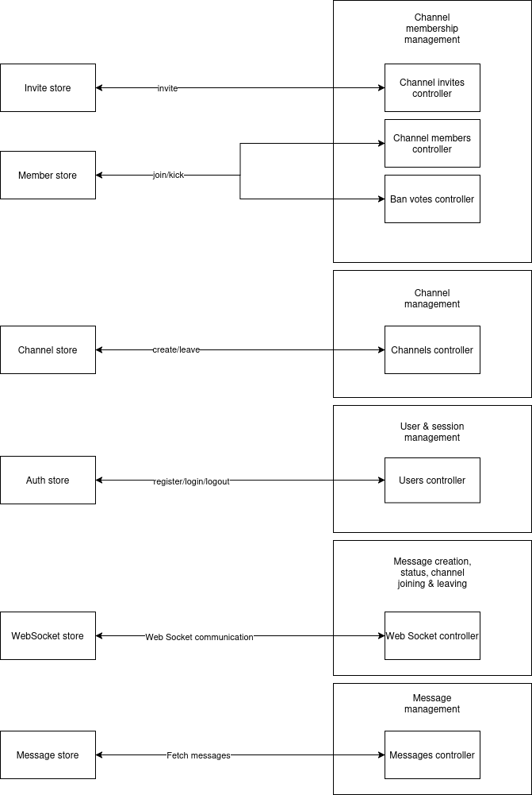
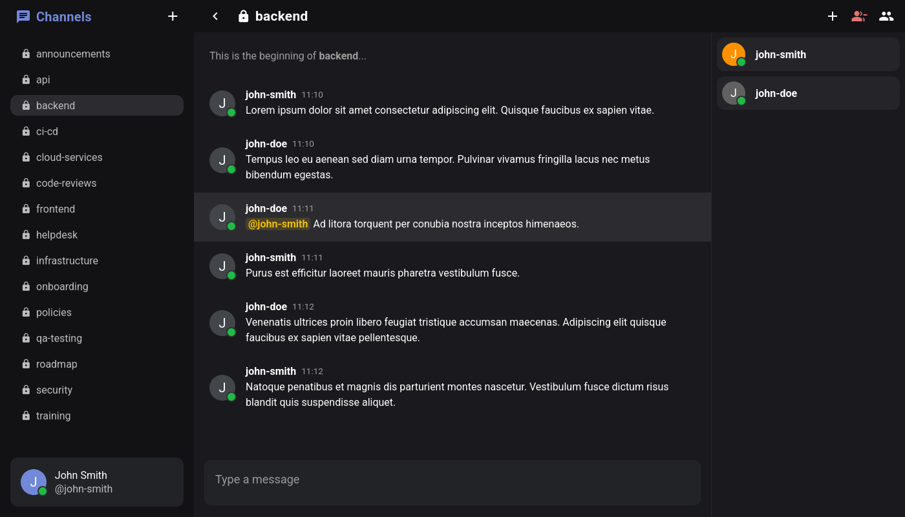
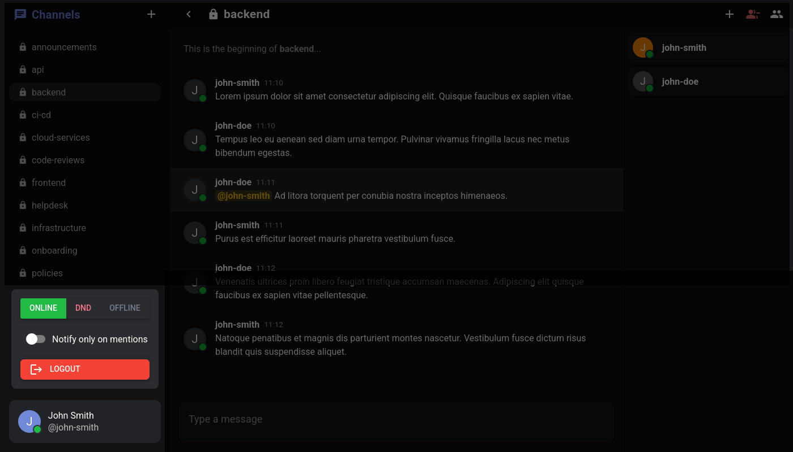
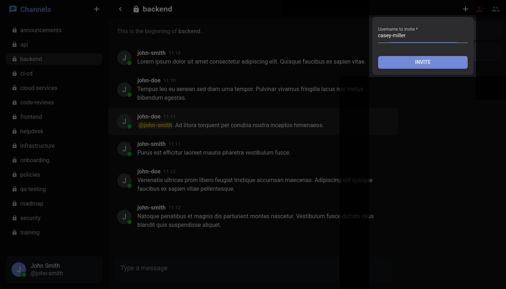
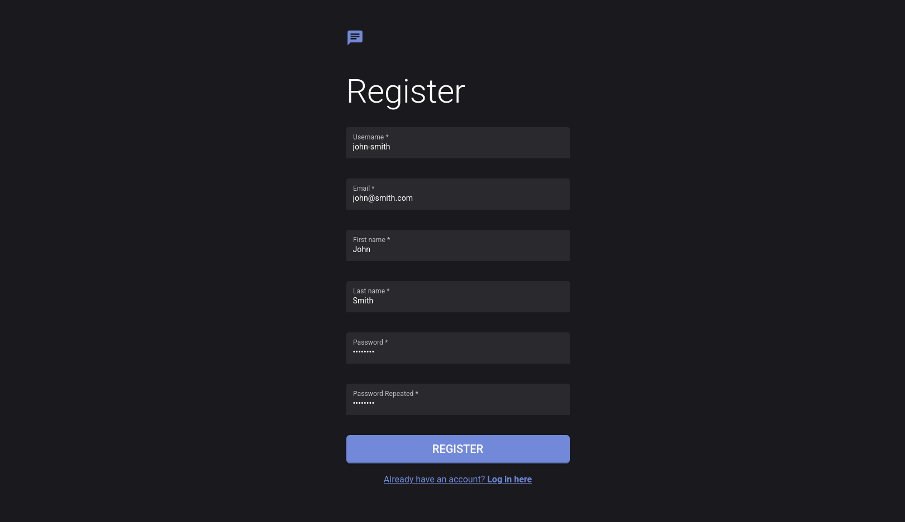
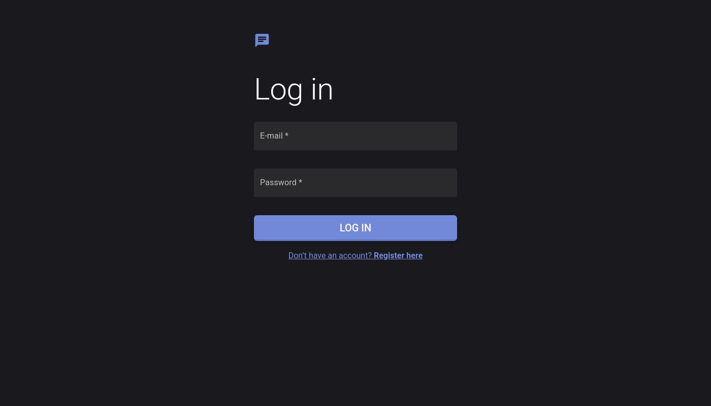

# Chat application

## Assignment

Create a progressive web application for IRC (Slack)-style text communication.

Full assignment link: https://github.com/kurice/vpwa26/tree/main/semestralny-projekt

## Physical data model diagram



## Application architecture diagram




## Design decisions

We tried to keep the number of dependencies minimal. On frontend, only `pinia` and `socket.io-client` were additionally installed. On backend, only `socket.io` was installed for web sockets.

- Almost all client side state is manipulated through Pinia stores to centralize state management
- Communication with BE is also (almost) exclusively handled by the stores
- Messages and user status are handled with web sockets

## Database changes from previous checkpoint

- Constraints were added on many fields
- Adonis specific tables were created for migrations (`adonis_schema`, `adonis_schema_version`, ...)
- Besides this, no significant changes were performed

## Screenshots









## Backend endpoints overview

```sh
METHOD ROUTE ................................................................... HANDLER MIDDLEWARE
POST   /users ................................................. UsersController.register
POST   /session .................................................. UsersController.login
POST   /channels ............................................. ChannelsController.create       auth
GET    /channels ............................................... ChannelsController.list       auth
GET    /channels/:id ............................................ ChannelsController.get       auth
GET    /channels/:id/messages .................................. MessagesController.list       auth
POST   /channels/join .................................... ChannelMembersController.join       auth
DELETE /channels/:id .................................... ChannelMembersController.leave       auth
GET    /channels/:id/members ............................. ChannelMembersController.list       auth
DELETE /channels/:id/kick/:userId ........................ BanVotesController.kickMember       auth
GET    /invites .......................................... ChannelInvitesController.list       auth
POST   /channels/:id/invite ............................ ChannelInvitesController.invite       auth
DELETE /channels/:id/invite/accept ............... ChannelInvitesController.acceptInvite       auth
DELETE /channels/:id/invite/reject ............... ChannelInvitesController.rejectInvite       auth
DELETE /users ................................................... UsersController.delete       auth
DELETE /session ................................................. UsersController.logout       auth
GET    /session ..................................................... UsersController.me       auth
```

## Development setup

### Requirements

- **Node.js 24.11.0** for both frontend and backend
- (optional) **Docker** to create Postgres database

### To set up backend (AdonisJS)

```sh
cd ./backend

# Install necessary packages
npm install

# Configure environment variables as described in the example .env
cp .env.example .env

# Generate app key (optional if custom one is used)
node ace generate:key

# Start the database
docker compose up -d

# Run the migrations
node ace migration:refresh --seed

# Run the backend
npm run dev
```

### To set up frontend (Quasar SPA)

```sh
cd ./frontend

# Install necessary packages
npm install

# Configure environment variables as described in the example .env
cp .env.example .env

# Run the frontend
npm run dev
```
